# Machine Learning Engineer Nanodegree
## Capstone Project
Gustavo Zadrozny Leyendecker

November 17, 2017

## I. Definition
_(approx. 1-2 pages)_

### Project Overview

Kickstarter is a community built with the purpose of funding projects specially
but not exclusively creative and artistic work. It can be anything, from software, a game or a gadget to the production of a film or music. The artist, filmmaker, designer, developer or creator can publish a proposal of his/her project and submit for crowdfunding. The community formed by more than 10 million people can than fund the project, each backer is able to contribute with an specific amount of money.

When submitting the project proposal, the project owner defines a goal that is
the total amount that he needs or expects for getting the project off the ground and a deadline for getting funded. If the goal is met in the end of the period, the owner gets funded, otherwise he gets nothing and the money goes back to the investors. [https://www.kickstarter.com/about]

Kickstarted released it's data for public access and a dataset was published on
Kaggle. [https://www.kaggle.com/codename007/funding-successful-projects]

The following list describes the attributes available on the dataset.
- project_id: unique id of project
- name: name of the project
- desc: description of project
- goal: the goal (amount) required for the project
- keywords: keywords which describe project
- disable communication: whether the project authors has disabled communication
option with people donating to the project
- country: country of project author
- currency: currency in which goal (amount) is required
- deadline: till this date the goal must be achieved (in unix timeformat)
- state_changed_at: at this time the project status changed. Status could be
successful, failed, suspended, cancelled etc. (in unix timeformat)
- created_at: at this time the project was posted on the website(in unix timeformat)
- launched_at: at this time the project went live on the website(in unix timeformat)
- backers_count: number of people who backed the project
- final_status: whether the project got successfully funded (target variable – 1,0)

The proposal on Kaggle is to solve the problem of predicting if a project will
get funded or not based on the information made available on the dataset.
This is a very relevant because this can help users to write better project and
get more funding, helping the economy and amount of money invested on crowdfunding.

### Problem Statement

Write code and create a model using one of more Machine Learning algorithms that predicts if a list of projects will get funded, optimized for accuracy. The resulting code can use all the attributes described above with the exception of `backers_count` and `final_status`.

### Metrics

The metrics used on this project to measure it's performance is the accuracy. The accuracy can be defined as the percentage of predictions that were accurate. Or total number of true positives added to the total number of true negatives divided  by the total population.

```code
accuracy = (true positives + true negatives) / total population
```

A sample from data instances that are available for training will be used for measuring
the performance of the code. Since there are more that 100k records for training, %5 of that will be enough for measuring the accuracy to evaluate the performacne of the solution.

## II. Analysis
_(approx. 2-4 pages)_

### Data Preparation
Before exploring the data some data transformation is needed. The following will be done:
1. Drop unnecessary columns
`state_changed_at` and `created_at` doesn't add much information to the data set. The
`state_changed_at` attribute can be changed at any time, before of after the contest is
finished. And it's most important to look at `launched_at` oposed to `created_at` dimension.

2. Replace `na` to empty strings on `name`, `desc` and `keywords` using the following code
block:
```Python
prepared['name'] = prepared['name'].fillna('')
prepared['desc'] = prepared['desc'].fillna('')
prepared['keywords'] = prepared['keywords'].fillna('')
```

3. Convert string types to data types on fields `launched_at` and `deadline`.

4. Create a new attribute that keeps the total time in days that a project is open to
receive investments. This is calculated by the difference of `deadline` and `launched_at`
attributes.


### Data Exploration

A data exploration will be done on the scalar, categorial and period variables of the dataset.


#### Scalar variables

The bellow tables describes the three scalar values from the dataset: `goal`, `backers_count`
and `days_open`. Please not that `backers_count` cannot be used for prediction as it's some
information that it's only available at the end of the period when the project is open
for crowdfunding.

||goal|	backers_count|	days_open|
|-|-|-|
|count|	108129.000	|108129.000	|108129.000|
|mean|	36726.229	|123.517	|33.881|
|std|	971902.705	|1176.745	|12.939|
|min|	0.010	|0.000	|1.000|
|25%|	2000.000	|2.000	|29.000|
|50%|	5000.000	|17.000	|30.000|
|75%|	13000.000	|65.000	|36.000|
|max|	100000000.000	|219382.000	|91.000|

There is a huge standard deviation on goal attribute, there must be some outliers like the
max value that is USD 100mi. Same for backers count. Lets see an histogram for goal and
another for backers count.

<center>
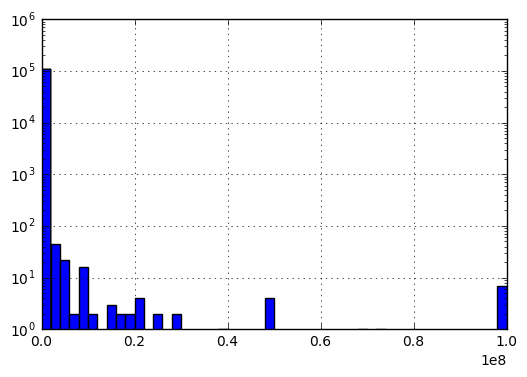<br>
Goal Histogram w/ Outliers
</center>

<center>
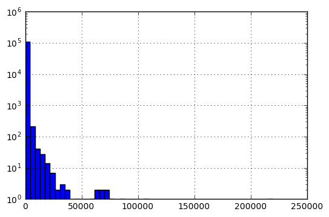<br>
Backers Count Histogram w/ Outliers
</center>

With that in mind, the top and bottom 5% values of backers count and goal will be considered
outliers and cut of from the dataset. Resulting is the table and histograms bellow.

||goal	|backers_count	|days_open
|-|-|-|
|count	|92581.000	|92581.000	|92581.000
|mean	|9118.470	|43.115	|34.015
|std	|11953.016	|63.195	|12.999
|min	|400.000	|0.000	|1.000
|25%	|2000.000	|2.000	|29.000
|50%	|5000.000	|17.000	|30.000
|75%	|10000.000	|57.000	|37.000
|max	|70000.000	|355.000	|91.000

Please notice that the standard deviation of goal fell from 971902.705 to 11953.016, and
backers count standard deviation changed from 1176.745 to 63.195.


<center>
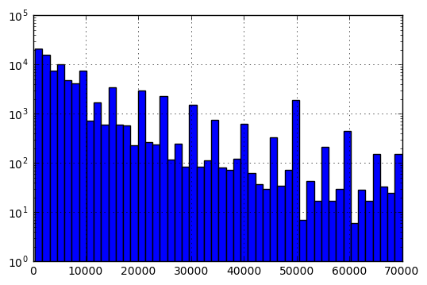<br>
Goal Histogram w/ Outliers
</center>

<center>
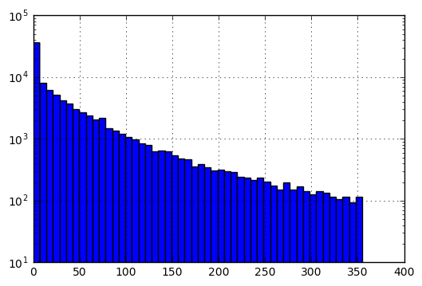<br>
Backers Count Histogram w/ Outliers
</center>

#### Categorical Variables

On the present dataset `disable_communication`, `country`, `currency` and `final_status` are the
categorical values. Please notice that `final_status` is the result that is expected to be
predicted.

||disable_communication|
|-|-|
|True    |   208|
|False   | 92373|


||country|
|-|-|
|US|    79585|
|GB|     7056|
|CA|     3086|
|AU|     1514|
|NL|      581|
|NZ|      319|
|SE|      148|
|DK|      125|
|IE|       88|
|NO|       78|
|DE|        1|

||currency|
|-|-|
|USD|    79585|
|GBP|     7056|
|CAD|     3086|
|AUD|     1514|
|EUR|      670|
|NZD|      319|
|SEK|      148|
|DKK|      125|
|NOK|       78|

||final_status|
|-|-|
|1|    26977|
|0|    65604|


### Period
There are 2 variables for period: `launched_at` and `deadline` they are shown
in the chart bellow and demonstrate how the number of projects increased over time.

<center>
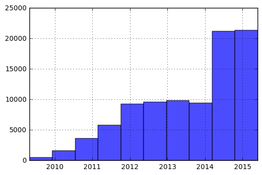<br>
Launched at Histogram
</center>

<center>
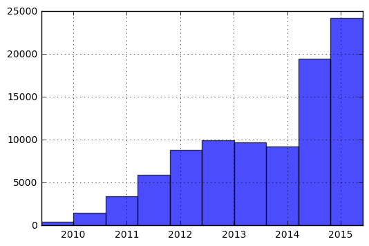<br>
Deadline Histogram
</center>


### Exploratory Visualization

In this section, the results of the exploratory data analysis is presented. Separating the
variables according to it's types that can be scalar, categorical, periodic or textual.
The main reason for doing this exploratory analysis is to understand how the variables
(or dimensions) relates to final_status variable.

#### Scalar variables

The scalar variables goal and days_open were investigated. Although backers_count is also
a scalar variable, it's a resulting variable and doesn't really mater how it related
to final_status.

As expected a correlation of goal and final_status was found as shown in the box plot bellow.
Projects with goals larger than 6.000 are rarely approved.

<center>
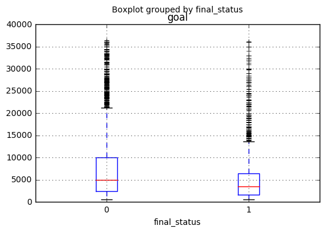<br>
Goal Box Plot
</center>

No strong correlation was fount on the days_open variable.


#### Categorical Variables

We have four categorical values on the dataset. Those are country, currency, disable_communication
and final_status. As final_status is the resulting value, it won't be directly investigated as the
intention of this analysis is to understand how other variables correlate to final_status.

There seems to be a correlation between country and final_status, but most important is that seems
to be related to if a project is based on US or not. There is a very similar relation on currency
that naturally follows the project nationality.

<center>
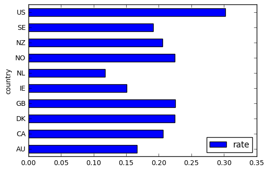<br>
Success Rate per Country
</center>

<center>
<br>
Success Rate per Currency
</center>

In terms of disable_communication, there is a very strong relation were it's observed that
no project with disable_communication got funded, as shown in the table bellow.

|disable_communication|final_status_T|	final_status_F|	rate|
|-|-|-|
|False|	22298|	54612|	0.290|
|True|	0|	166|0.000|

#### Period Variables

The period variables that were investigated are launched_at and deadline. There is a notable
correlation between the year that the project was launched and the final_status. The success
rate decreases by the passage of years. This is due to a supply vs demand effect were
much more projects are being submitted and not many people interested on putting money into
those projects.

<center>
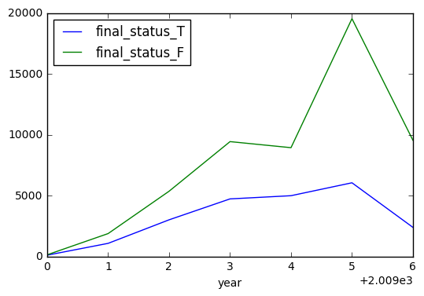<br>
Project Per Year
</center>

<center>
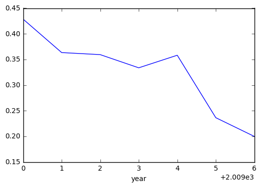<br>
Success Rate Per Year
</center>

Please notice on the charts bellow that there is a significant increate of projects
launched on 2014 that reflects on a drop on the success rate in the same period.

##### Day of Week

There was also investigated the day of the week and month that the project was created
in a way to understand if this reflects on projects success rate. There seems to be
a correlation on day of week as show on the figure bellow. On the green line, the
success rate is plotted based on the day of week on the deadline. And blue line the
success rate per day of week of launch date. On x-axis, day of week from Monday to
Sunday. So seems to be best to open the project on a Sunday with deadline on Monday
or Tuesday.

<center>
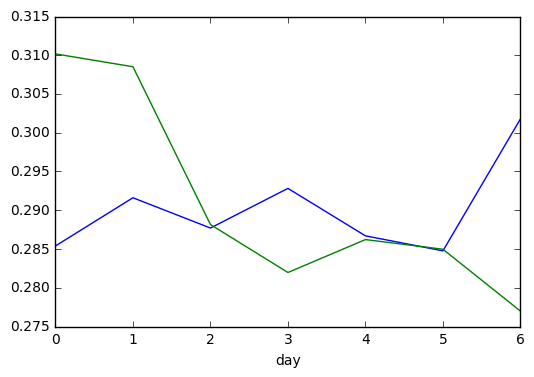<br>
Success Rate Per Day of Week
</center>

#### Textual Variables

The intuition is that the category of the project is highly correlated to the final_status
or success of the project. In this dataset we do not have category of the project even thought
it could be gathered from an external data source like crawling the kickstater site, it's not
in the scope of this project. For this reason, the textual variables might be highly important
for the classification.

There are three (3) textual variables: name, description and keywords. All of them are
investigated creating a bag of words an calculating it's relevance using Term Frequency -
Inverse Document Frequency (TD-IDF) [Reference Needed].
The relevance is calculated for successful and not successful projects so those bad of
words and relevance can be verified on the tables bellow.

- Name Variable

||rel|	rel0|	rel1|
|-|-|-|
|album|	1196.045|	741.204|	469.266|
|new|	900.298|	560.219|	352.237|
|film|	768.834|	445.001|	328.651|
|project|	852.784|	617.870|	249.407|
|debut|	548.325|	332.204|	224.251|
|short|	469.968|	252.393|	219.361|
|ep|	493.354|	314.560|	186.219|
|book|	629.764|	466.109|	171.575|
|music|	592.345|	431.703|	168.974|
|record|	350.055|	193.232|	159.644|

- Description Variable

||rel|	rel0|	rel1|
|-|-|-|
|help|1364.462|917.842|458.155|
|album|1033.002|640.131|395.367|
|new|1153.798|768.682|395.143|
|music|908.425|653.434|263.543|
|film|626.003|388.907|239.199|
|record|582.001|347.243|235.946|
|need|683.009|478.984|210.792|
|world|780.506|577.753|209.461|
|make|681.996|488.210|200.592|
|book|743.212|558.724|189.867|

- Keyword Variable

||rel|rel0|rel1|
|-|-|-|
|album|1125.279|694.092|446.947|
|new|879.093|546.597|345.538|
|film|731.715|421.590|315.112|
|project|796.624|576.866|233.662|
|debut|534.006|323.058|219.937|
|short|451.485|240.044|213.166|
|ep|489.315|313.385|184.012|
|book|596.353|440.915|163.288|
|music|562.640|409.154|161.962|
|help|482.915|333.928|156.931|


It's notable that some of the words repeat on the different variables. For that reason it's
likely that for optimizing the algorithm only one variable shall be used.

### Algorithms and Techniques

The classification will be made taking into account the textual variables. This shall be
done using the Bag of Words technique. On a Bag of Words, each words or combination of words
in a N-gram is a dimension. With that in mind, the algorithm used for this classification
needs to perform well with highly dimension data.

There are two algorithms that should be tested to see witch one performs better, the
Naive Bayes and Linear Reggression [http://fastml.com/classifying-text-with-bag-of-words-a-tutorial/].

To boost performance, the N-gram approach should be considered as well as using TD/IDF.

### Benchmark

Dilip Lilaramani submitted his work in this dataset were he compares the performance for this
prediction using different algorithms. The table bellow summarize the results he got.

|Algorithm|Accuracy|
|-|-|
|LogisticRegression| 0.680281|
|LinearDiscriminantAnalysis| 0.677164|
|KNeighborsClassifier| 0.646913|
|DecisionTreeClassifier| 0.601920|
|GaussianNB| 0.353651 |

https://www.kaggle.com/dilipajm/kickstarter-project-funding-prediction

The goal for this project is to get a classifier that scores higher than 0.680281 by making use of text variables.

## III. Methodology
_(approx. 3-5 pages)_

### Data Preprocessing

Most of the data preprocessing and feature engineering was done on the data exploration phase. The code block bellow was used to preprocess the data on data exploration phase.

``` Python
# 1. Drop state_changed_at and created_at (launched_at and deadline are the dates that matter)
prepared = original.drop(['created_at', 'state_changed_at'], axis=1)
# 2. Replace na to empty strings on name, desc and keywords
prepared['name'] = prepared['name'].fillna('')
prepared['desc'] = prepared['desc'].fillna('')
prepared['keywords'] = prepared['keywords'].fillna('')
# 3. Convert data types
prepared['launched_at'] = prepared['launched_at'].apply(dt.fromtimestamp)
prepared['deadline'] = prepared['deadline'].apply(dt.fromtimestamp)
# 4. Create attribute days open (deadline - launched at)
prepared['days_open'] = [x.days for x in (prepared['deadline'] - prepared['launched_at'])]
```

1. Feature `created_at` dropped because does not gather much information, `launched_at` was used to understand when project was launched
2. Feature `state_changed_at` dropped, always after end of poll
3. Fill null values with empty string on features `name`, `desc` and `keywords`
4. Convert string to datetime on features `launched_at` and `deadline`
5. Created a new feature `days_open` with the number of days that the project remained opened for funding.
6. Split `X` and `y` vectors for among train and test datasets
7. Use k-fold package to

At the end of the Data Exploration, the dataset was stored into a CSV file for later use at `data/processed.csv`.


### Implementation

The implementation consists of the code written in Python 2.7. Two modules were written, one to figure out the best algorithm and number of features on the 3 Bag of Words created from the dataset and the second to figure out the best parameters for the chosen algorithm.

On both modules, data is read from `data/processed.csv` created previously on this project.

#### Algorithm and Features Selection

To select the algorithm and the number of features on each BoW, code was written as follows:

1. For every combination of feature sizes on `name`, `desc` and `keywords`
2. For each algorithm selected
3. Create bag of words for the features `name`, `desc` and `keywords`, storing the results on the sparse vector X, using algorithm TD/IDF
4. Store additional `deadline`, `launched_at`,  `days_open`, `disable_communication`, `goal` and `country` features on sparse vector `X`
- `deadline` and `launched_at` features should be converted to year/month format
5. Store the feature `final_status` to be predicted at `y` vector
6. Split training set and test set (5% for test)
7. Fit the model
8. Get the score of the model
9. Store results on `data/results.csv` for later analysis

The code block bellow shows the meaningful part of this implementation.

```python
models = [
    ('SGD', SGDClassifier(random_state=42)),
    ('DT', DecisionTreeClassifier(random_state=42)),
    ('RF', RandomForestClassifier(random_state=42))
]

kw_features_r = range(0, 200, 50)
name_features_r = range(0, 2501, 500)
desc_features_r = range(0, 2501, 500)

total = len(desc_features_r) * len(name_features_r) * len(desc_features_r)
index = 0
res = []
for desc_features in desc_features_r:
    for name_features in name_features_r:
        for kw_features in kw_features_r:
            X = None
            if kw_features > 0:
                X = hstack((X, TfidfVectorizer(max_features=kw_features).fit_transform(list(data['keywords']))))
            if name_features > 0:
                X = hstack((X, TfidfVectorizer(max_features=name_features).fit_transform(list(data['name']))))
            if desc_features > 0:
                X = hstack((X, TfidfVectorizer(max_features=desc_features).fit_transform(list(data['desc']))))

            X = hstack((X, np.column_stack((data.index.tolist(), data['deadline'].apply(lambda x: x.year + x.month/12.0).as_matrix()))))
            X = hstack((X, np.column_stack((data.index.tolist(), data['launched_at'].apply(lambda x: x.year + x.month/12.0).as_matrix()))))
            X = hstack((X, np.column_stack((data.index.tolist(), data['days_open'].tolist()))))
            X = hstack((X, np.column_stack((data.index.tolist(), data['disable_communication'].tolist()))))
            X = hstack((X, np.column_stack((data.index.tolist(), data['goal'].tolist()))))
            X = hstack((X, np.column_stack((data.index.tolist(), data['country'].cat.codes))))

            y = data['final_status']
            X_train, X_test, y_train, y_test = model_selection.train_test_split(X.toarray(), y, test_size=0.05, random_state=42)

            sample = {}
            sample['kw_features']   = kw_features
            sample['name_features'] = name_features
            sample['desc_features'] = desc_features
            for name, model in models:
                model.fit(X_train, y_train)
                score = model.score(X_test, y_test)
                sample[name] = score

            res.append(sample)
            pd.DataFrame(res).to_csv('data/results.csv', index=False, sep= ';')
            index += 1
            print "%s/%s - %.2f%%" % (index,total,(index*100.0/total))
```


#### Refinement

Based on previous process, the Random Forest Classifier was selected as the best model for this problem. Also, for that algorithm the number of features on each BoW that allows the algorithm to perfom better are 100 features for keywords, 1500 feature for name and 2500 for description. Now it's important to try to get the best parameters for this model in an attempt for tunning the performance of the model. The Scikit model for the purpose is the GridSearchCV and that is what is being used for the refinement of the model.

The parameters chosen to be tested are the number of estimators, criterion and out of bag score. The results of that test are being store on a CSV file at `data/results_refinement.csv`. The code block bellow shows the meaningful part of this implementation.

```python
param_grid = {
  'n_estimators' : [10, 50, 100, 200, 500, 1000],
  'criterion'    : ['gini', 'entropy']
}

X = None
X = hstack((X, TfidfVectorizer(max_features=100).fit_transform(list(data['keywords']))))
X = hstack((X, TfidfVectorizer(max_features=1500).fit_transform(list(data['name']))))
X = hstack((X, TfidfVectorizer(max_features=2500).fit_transform(list(data['desc']))))
X = hstack((X, np.column_stack((data.index.tolist(), data['deadline'].apply(lambda x: x.year + x.month/12.0).as_matrix()))))
X = hstack((X, np.column_stack((data.index.tolist(), data['launched_at'].apply(lambda x: x.year + x.month/12.0).as_matrix()))))
X = hstack((X, np.column_stack((data.index.tolist(), data['days_open'].tolist()))))
X = hstack((X, np.column_stack((data.index.tolist(), data['disable_communication'].tolist()))))
X = hstack((X, np.column_stack((data.index.tolist(), data['goal'].tolist()))))
X = hstack((X, np.column_stack((data.index.tolist(), data['country'].cat.codes))))


model = GridSearchCV(RandomForestClassifier(random_state=42, n_jobs=2, criterion='entropy'),cv=5,
    param_grid=param_grid)
    y = data['final_status']
    X_train, X_test, y_train, y_test = model_selection.train_test_split(X.toarray(), y, test_size=0.05, random_state=42)

    model.fit(X_train, y_train)
    score = model.score(X_test, y_test)
    print score


```

## IV. Results
_(approx. 2-3 pages)_

### Model Evaluation and Validation

On the Algorithm and Feature Selection phase a combination of number of features of keywords, names and description bag of words were run with 3 classifiers: Random Forest, Stochastic Gradient Descent and Decision Tree. The accuracy was stored for later analysis that follows.

Using only one BoW we have the 3 charts bellow.

<center>
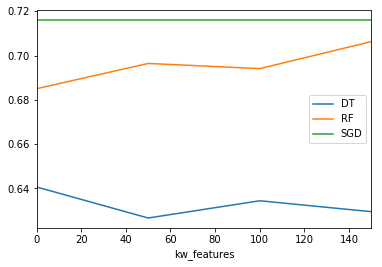<br>
Classifiers with Keywords BoW
</center>

<center>
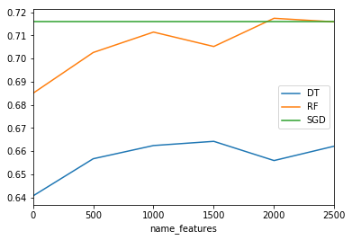<br>
Classifiers with Names BoW
</center>

<center>
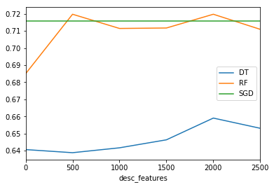<br>
Classifiers with Description BoW
</center>

The Stochastic Gradient Descent remain constant on all three charts, meaning that it's not taking advantage of the BoW doesn't matter it's size. There is a small improvement on Decision Tree Classifier when adding BoW but the classifier that take most advantage of it seems to be the Random Forest Classifier. From these charts the best number of features for the Random Forest seems to be 150 features for Keyword BoW, 2000 for Name BoW and 500 for Description BoW.

As we order the results by descending accuracy we can have a more precise view of the best algorithms, the following tables present the top 5 results for each of the classifiers.

- Best BoW for Decision Tree Classifiers

|#|kw_features|	name_features|	desc_features|	DT|
|-|-|-|-|-|
|90|	100|	2000|	1500|	0.671251|
|13|	50|	1500|	0|	0.670213|
|17|	50|	2000|	0|	0.668915|
|56|	0|	1000|	1000|	0.668915|
|143|	150|	2500|	2500|	0.668656|

- Best BoW for Random Forest Classifiers

|#|kw_features|	name_features|	desc_features|	RF|
|-|-|-|-|-|
|134|	100|	1500|	2500|	0.728075|
|56|	0|	1000|	1000|	0.726518|
|46|	100|	2500|	500|	0.726258|
|114|	100|	2000|	2000|	0.725221|
|62|	100|	1500|	1000|	0.724702|

- Best BoW for Stochastic Gradient Descent Classifiers

|#|kw_features|	name_features|	desc_features|	SGD|
|-|-|-|-|-|
|0|	0|	0|	0|	0.71588|
|1|	50|	0|	0|	0.71588|
|92|	0|	2500|	1500|	0.71588|
|93|	50|	2500|	1500|	0.71588|
|94|	100|	2500|	1500|	0.71588|


Considering those 3 tables above, the best algorithm for this problem is the Random Forest Classifier with a configuration of 100, 1500 and 2500 features for the keywords, name and description bag of words. This is the configuration that was used on the algorithm refinement.

Running the GridSearchCV for refined took 15 hours in a 2.9 GHz Intel Core i5 processor. After finished, the results stored on `data/results_refinement.csv` from which the following chart and table were created.

<center>
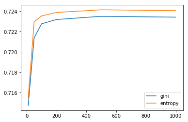<br>
Result Refinement
</center>

|#|	criterion|	n_estimators|	score|	std|
|-|-|-|-|-|
|0|	gini|	10|	0.714731|	0.002425|
|1|	gini|	50|	0.721395|	0.001257|
|2|	gini|	100|	0.722775|	0.001043|
|3|	gini|	200|	0.723198|	0.001240|
|4|	gini|	500|	0.723512|	0.001019|
|5|	gini|	1000|	0.723430|	0.001547|
|6|	entropy|	10|	0.715495|	0.002676|
|7|	entropy|	50|	0.722979|	0.001525|
|8|	entropy|	100|	0.723553|	0.001298|
|9|	entropy|	200|	0.723894|	0.002309|
|10|	entropy|	500|	0.724154|	0.002508|
|11|	entropy|	1000|	0.724072|	0.002237|


It's important to notice that an increasing number of estimator, creating more complex models does not significant improve the results after 500 estimators. Also we can notice that the entropy criterion performs better than gini method.
Best model uses entropy criterion and 500 estimators.


### Justification

The resulting model identified as the best solution found on this work used the Random Forest Algorithm using a number of 500 estimators and entropy criterion. For it's input the dimensions deadline, launched_at, days_open, diable_communication, goal and country were used together with 3 bags of words created by textual data from Keywords, Name and Description dimensions using TD/IDF algorithm limiting to total number of features at 150 keywords features, 2500 name features and 1500 description features.

Using an independent training set, the resulting model got and accuracy score of 0.7304. This outperforms the benchmark project that presented an accuracy score of 0.680281. Considering that the 68.04% of the projects are not approved, a classifier that always return a negative result would score 0.6804 for accuracy, so the proposed algorithm can be useful for increasing the change for a successful prediction.

## V. Conclusion
_(approx. 1-2 pages)_

### Reflection

Predicting results of Kickstarter competition for funding project turns out to be a big challenge. The intuition was that the project category would have a strong correlation with the success of the project, but there is no such dimension on the dataset used. On the Exploratory Data Analysis, no strong correlation was found on other dimensions.

Text regarding project name, description and keywords might reflect on it's category improving the algorithm. The keywords album, film or book probably mean artistic projects. Also, some specific words on the writing of the project description like help, need, world or disruptive might boost the project acceptance rate. With that in mind, the Bag of Words approach was chosen for gathering information from textual data.

The first section of Chapter IV: Model Evaluation and Validation shows that some algorithms improved it's performance using the Bags of Words, should that it there is some value to that technique.

A model with accuracy score of 0.7304 was generated by tunning the Random Forest Classifier for this problem, meaning that it will predict if a project will be approved or not on 73% of the time, which is better than the benchmark so the model was successful but must be surely improved for use on a product.

### Improvement

In this project a simple model was created taking advantage of the usage of Bag of Words to predict kickstarter results along with other dimensions. It performed better than the benchmark but the model used as a comparison don't have a performance better than a model were all results were false, so it's not very good.

A better benchmark would be an educated guess of a user reading project description and evaluating other dimensions based on his intuition. In this case, it's possible the the benchmark would outperform the model generated in this project.

A better model for predicting Kickstarter projects can be achieved by taking advantage of other Machine Learning techniques and gathering more information about the dataset.

Suggestions regarding Machine Learning algorithms and techniques:
- Improve Bag of Words performance by using a custom made dictionary
- Test different classification Algorithms
- Combine with external datasets such as industry venture capital investments on each sector / category
- Alternative feature engineering process and trying to identify / remove outliers more carefully

The dataset should also be improved and more information should be gathered. The category in which the project is running might be very useful for the prediction model. Also the user that opens the project and the number of projects that this user previously submitted might also be very relevant.

Improving the model with those suggestions it's possible to create a model that would outperform an educated guess on the performance of the project made by an user. Understanding this model if very important to help users write better projects with better chance to get his/her project funded.
